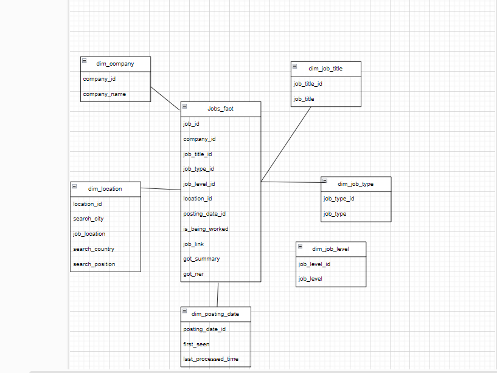
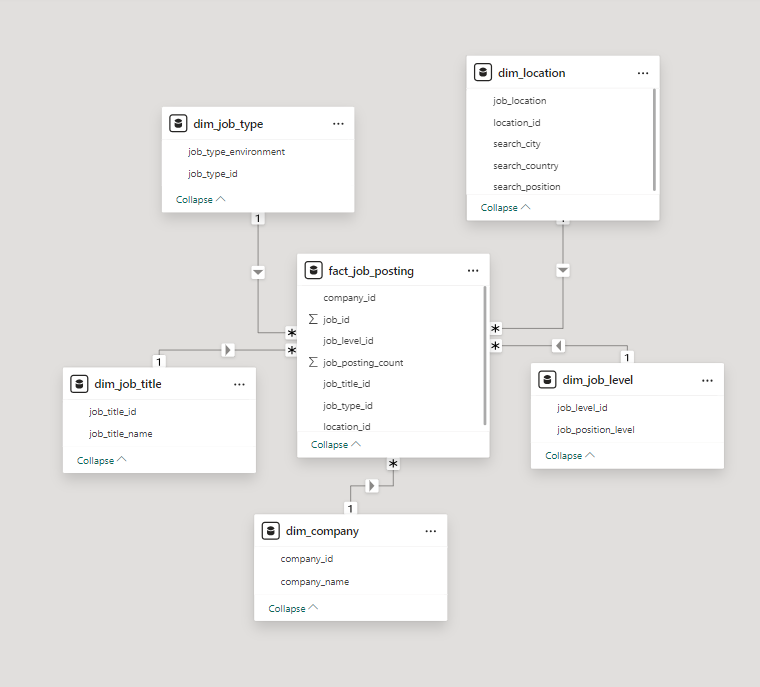
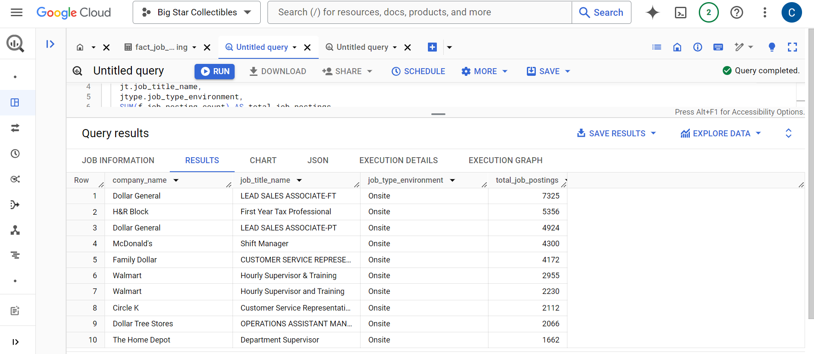
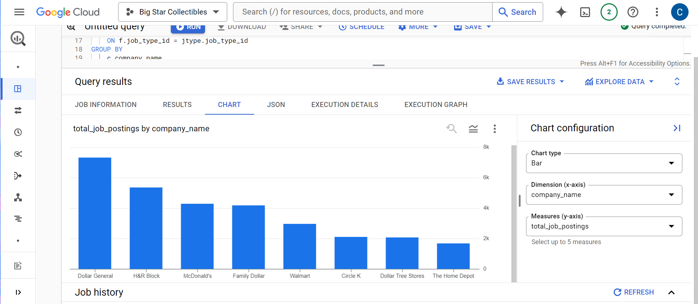

# linkedin-data-eng-project

- This Linkedin Data Engineer project was designed to practice with various data engineering technologies. In this project, I used a Kaggle data set "1.3M Linkedin Jobs & Skills (2024)", which I extracted via Airbyte and loaded into BigQuery. The data was modeled using a star schema, leveraging dbt Core for transformations. To orchestrate and manage workflows, I utilized Google Cloud Composer. Finally, I validated and visualized the data models using Power BI.

- To see dbt project documentation
--dbt docs generate
--dbt docs serve

airbyte
http://localhost:8000
- Star Diagram

- Linkedin Job Postings Lineage

- Example of a query to calculates the number of job postings per company, grouped by job title and job type made via Big Query

- Power BI - Dashboard

